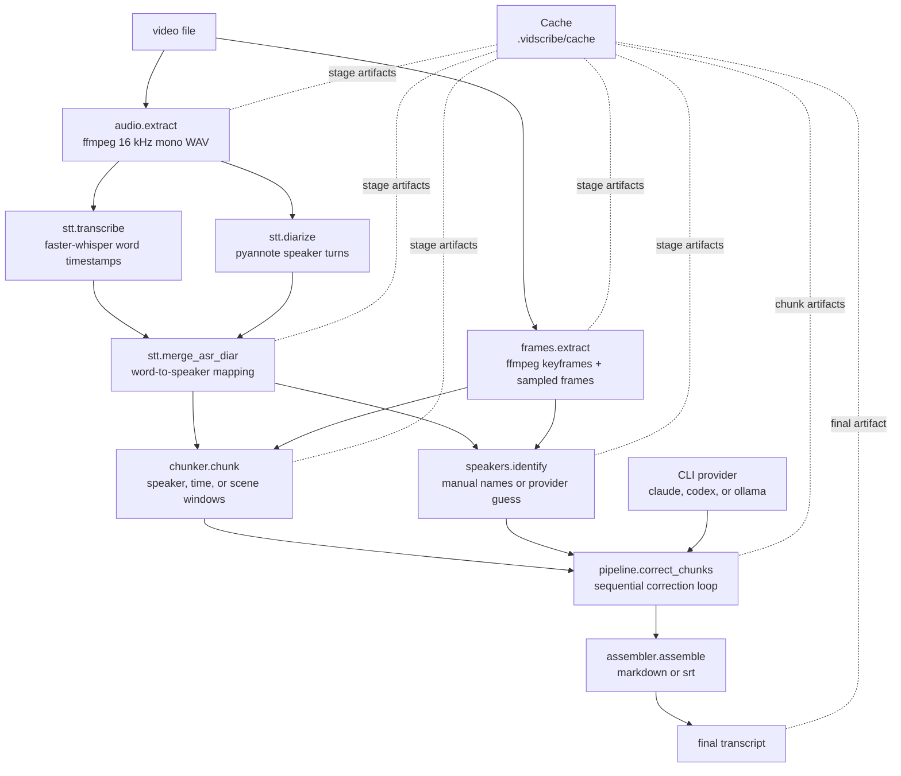

# vidscribe architecture

vidscribe is a local-first video transcription pipeline. Heavy media and speech
work runs locally, while transcript cleanup is delegated to a CLI provider
subprocess.



## Stages

1. Audio extraction converts input video to mono 16 kHz WAV with ffmpeg.
2. Frame extraction writes sampled keyframes and `frames.json`.
3. STT runs faster-whisper with word-level timestamps.
4. Diarization runs pyannote and returns speaker turns.
5. Merge assigns each ASR word to the speaker turn with maximum overlap.
6. Chunking groups diarized transcript segments and attaches nearby frames.
7. Speaker identification maps `SPEAKER_*` ids to manual names, provider names,
   or stable fallbacks such as `s00`.
8. Correction renders one prompt per chunk, calls the selected CLI provider, and
   accumulates glossary deltas between chunks.
9. Assembly merges adjacent speaker turns and writes the final transcript.

## Cache layout

Artifacts are stored under `.vidscribe/cache/`. The video input is hashed first,
then each stage stores its own files or JSON payloads.

```text
.vidscribe/cache/{video_sha256}/
  audio/audio.wav
  stt/artefact.json
  frames/frames.json
  frames/frame_*.jpg
  chunks/artefact.json
  speakers/artefact.json
  corrected/artefact.json
  final/artefact.md
```

Correction chunks use a separate cache key that includes the chunk payload,
provider class, provider model, and glossary snapshot. That makes it possible
to rerun only failed or provider-specific correction work without repeating
audio, STT, diarization, or frame extraction.

## Model assets

The default `noscribe-precise` and optional `noscribe-fast` aliases point to
CTranslate2 Whisper weights inside noScribe.app:

```text
/Applications/noScribe.app/Contents/Resources/models/precise/
/Applications/noScribe.app/Contents/Resources/models/fast/
```

Local pyannote files are loaded from:

```text
/Applications/noScribe.app/Contents/Resources/pyannote/config.yaml
/Applications/noScribe.app/Contents/Resources/pyannote/segmentation/pytorch_model.bin
/Applications/noScribe.app/Contents/Resources/pyannote/embedding/pytorch_model.bin
```

When those files are missing, pass a regular faster-whisper model name and use
Hugging Face authentication for pyannote fallback diarization.
